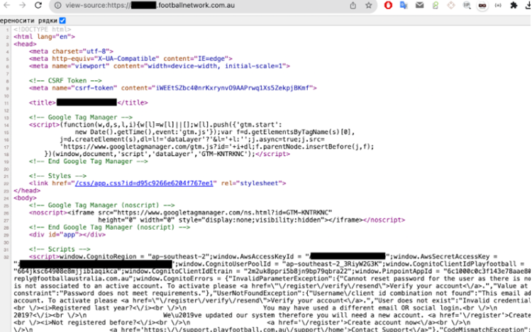
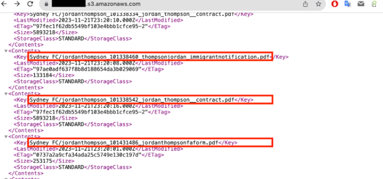

Football Australia, the national governing authority for the sport, embedded an AWS Access Key in their website that granted access to 126 S3 Buckets containing sensitive information for players and fans.

<!--more--> <!-- This separates the synopsis from the main body -->

## Incident

### Details of the Incident

An AWS long-term Access Key was embedded into the source code for the Football Australia website. As seen in the screenshot below ([courtesy CyberNews](https://cybernews.com/security/football-australia-leak-expose-players/)) it looks related to Cognito:

> Moreover, one of the buckets was left completely unprotected, which means it was left public and accessible without any keys. The public digital storage container contained football players’ passports and contracts.

 Image by Cybernews.

Per a statement from Football Australia to CyberNews:
> the exposed data includes:
>
> * Personal identifiable information of players
> * Ticket purchase information
> * Internal infrastructure details
> * Source code of the digital infrastructure
> * Scripts of the digital infrastructure

### Timeline
| Date | Event |
| ------ | ----- |
| **March 2022** | 681 days prior to disclosure, the access keys are exposed (source: [Sydney Morning Herald](https://www.smh.com.au/technology/players-passports-contracts-exposed-in-football-australia-data-breach-20240201-p5f1kr.html))|
| **February 1, 2024** | Responsible Disclosure disclosed  |

### Long-term Impact

None yet.

## Summary of Coverage
* The Sydney Morning Herald: [Players’ passports, contracts exposed in Football Australia data leak](https://www.smh.com.au/technology/players-passports-contracts-exposed-in-football-australia-data-breach-20240201-p5f1kr.html) - February 1, 2024
* CyberNews: [Football Australia leak exposes players’ details](https://cybernews.com/security/football-australia-leak-expose-players/) - February 1, 2024

## Cloud Security Lessons Learned

* There was no reason for an access key to be embedded into the website for the purposes of leveraging Cognito.
* Long-term access keys were not rotated for almost two years
* Football Australia has a _public_ S3 bucket with sensitive player details in it. A [Macie](https://www.primeharbor.com/blog/revisiting-macie/) scan of public S3 Buckets might have caught this.
* The aforementioned bucket was also _publicly listable_ as seen in the above screenshot. There is almost never a good reason to have an S3 bucket where anyone can list the contents.

